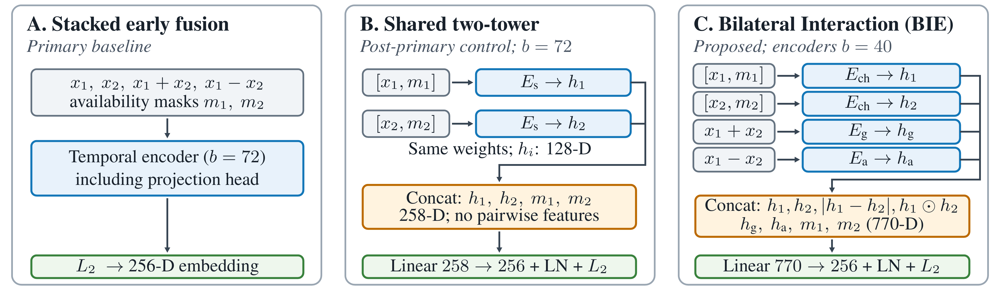

# OpenBreath-ID

Code and figures for **OpenBreath-ID: Observation Budgets in Nasal Verification**.
The study compares neural representations for subject-disjoint verification
from bilateral nasal respiratory signals, using separate enrollment and probe
observations within a recording.

## Quick start

Use Python 3.12 in an isolated environment:

```bash
python -m venv .venv
# Activate the environment, then:
python -m pip install -e ".[dev]"
python examples/synthetic_demo.py
python -m pytest -q
```

The demonstration uses synthetic signals and untrained models; it does not
reproduce the paper's EERs. See [environment notes](docs/ENVIRONMENT.md).

## Reproduce the experiments

1. Obtain the data from the [original authors](https://github.com/TimnaSoroka/identification_paper/tree/code).
2. Follow the [reproduction guide](docs/REPRODUCIBILITY.md).
3. Use [primary experiment settings](configs/primary.json), not legacy command defaults.

The current release supports installation checks, local data/split preparation,
training-job preparation and figure regeneration. End-to-end EER reproduction
is not yet packaged. Data and checkpoints are not included; classical/fusion
code is unavailable pending redistribution permission.

## Contents

- `src/openbreath_id/`: preprocessing, neural models, training and evaluation utilities.
- `configs/primary.json`: experiment settings.
- `docs/`: reproduction and implementation notes.
- `figures/` and `results/`: editable figures and aggregate results.
- `tests/` and `examples/`: synthetic tests and demonstration.



## Data and attribution

Dataset: Soroka et al., [Humans have nasal respiratory fingerprints](https://doi.org/10.1016/j.cub.2025.05.008).
Obtain original data under its applicable terms. See [data scope](docs/DATA_AND_SCOPE.md)
and [third-party notices](THIRD_PARTY_NOTICES.md). No open-source license has yet been assigned.
